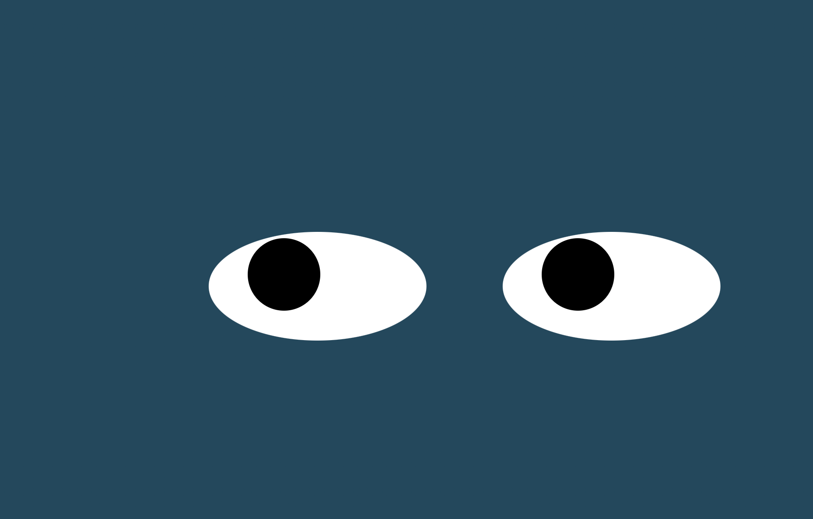

# Eyes
## My Repo for Eyes </a>
## I plan on getting a beter understanding of making changes to allow this to function better from where this repo is published in Pages. The point of this exercise was two create two similar objects, shaped like eyes, that the inner image would follow the mouse on your computer.

                                    
